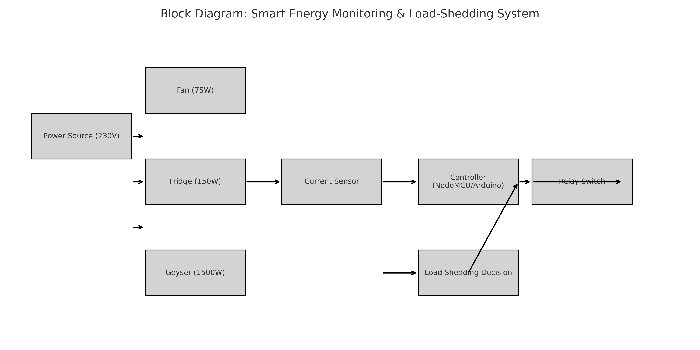

# 🔌 Smart Energy Monitoring & Load-Shedding System

This project simulates a smart electrical energy management system that monitors real-time power usage and dynamically disconnects non-essential loads during overload conditions. It replicates low-voltage switchgear logic commonly used in home and industrial power panels.

---

## ⚙️ Project Features

- Real-time current calculation from multiple household loads
- Dynamic load shedding logic based on overload detection
- Prioritization of critical vs. non-critical loads
- MATLAB and Simulink simulation models
- Clean block diagram and BoM for implementation

---

## 📊 Load Simulation Details

| Appliance | Power (W) | State            |
|-----------|-----------|------------------|
| Fan       | 75W       | Always ON        |
| Fridge    | 150W      | Always ON        |
| Geyser    | 1500W     | ON (3s to 7s)     |

- Voltage: 230V  
- Overload threshold: 10A  
- Load shedding is triggered when total current exceeds threshold.

---

## 🛠️ Tools & Technologies

- **MATLAB**: For current calculation, logic design, and data visualization
- **Simulink**: Block-based simulation of current sensors, relays, and decision logic
- **Fritzing / AutoCAD** *(optional)*: For circuit diagrams
- **NodeMCU/Arduino (optional)**: For hardware implementation

---

## 📁 Files Included

| File | Description |
|------|-------------|
| `smart_energy_simulation.m` | MATLAB script for current plot and logic |
| `smart_energy_model_data.mat` | Simulink-compatible current data |
| `smart_energy_simulink.slx_data.mat` | Data for use in Simulink’s `From File` block |
| `smart_energy_block_diagram.png` | Visual block diagram of the full system |
| `README.md` | Project documentation |

---

## 📷 Block Diagram

---

## 🚀 Getting Started

1. Open `smart_energy_simulation.m` in MATLAB and run the script.
2. To simulate in Simulink:
   - Use the `From File` block to import `smart_energy_simulink.slx_data.mat`
   - Connect blocks like `Compare To Constant`, `Switch`, and `Scope`
3. (Optional) Use the circuit diagram to implement in hardware using NodeMCU, relays, and ACS712.

---

## 📄 License

This project is open-source and available under the [MIT License](LICENSE).

---

## 🙌 Contributions

Feel free to fork, enhance, or suggest improvements via pull requests or issues!

